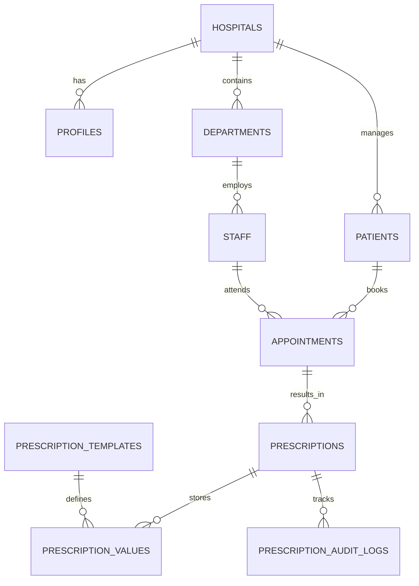

# Multi-Tenant Hospital Management System: Technical Deep Dive

## 1. Project Overview & Ideology

The **Multi-Tenant Hospital Management System** is a scalable, cloud-native SaaS platform designed to streamline hospital operations, with a primary focus on the **Doctor-Patient encounter**. 

### Core Ideology
*   **Patient-Centricity**: Ensuring medical history and prescriptions are accurate, accessible, and structured.
*   **Doctor Efficiency**: Reducing administrative friction through AI-assisted documentation and dynamic templates.
*   **Data Sovereignty & Privacy**: Using multi-tenant isolation and local AI processing to ensure sensitive medical data remains secure.
*   **Scalability**: A modular architecture that allows hospitals to customize workflows via a dynamic schema.

---

## 2. Detailed Technology Stack

The system leverages a cutting-edge, hybrid architecture optimized for performance and privacy.

### Frontend (User Interface)
*   **Next.js (App Router)**: Handles both client and server-side rendering, providing a fast, SEO-friendly experience.
*   **Tailwind CSS**: A utility-first CSS framework for rapid, responsive UI development.
*   **Radix UI & shadcn/ui**: Used for building high-quality, accessible UI components like modals, dropdowns, and complex forms.
*   **Lucide React**: Provides a consistent, modern icon set.

### Backend & Infrastructure
*   **Supabase (PostgreSQL)**: The backbone of the system, providing relational storage, real-time subscriptions, and built-in Auth.
*   **PostgreSQL RLS (Row-Level Security)**: Enforces tenant isolation at the database level, ensuring data privacy across hospitals.
*   **Next.js Server Actions**: Enables secure, type-safe data mutations without the need for a separate REST/GraphQL API layer.

### AI & Machine Learning (Hybrid Layer)
*   **OpenAI Whisper (Base/Medium)**: An open-source speech recognition model used for local transcription of medical consultations.
*   **spaCy (en_core_web_sm)**: A lightweight NLP library used for Named Entity Recognition (NER) to extract symptoms and vitals.
*   **FastAPI**: A high-performance Python web framework that hosts the local AI microservice.

---

## 3. Database Design & Architecture

The database is designed for multi-tenancy and high relational integrity.

### Core Entity Relationships (ERD)



### Key Design Patterns
*   **JSONB for Dynamic Data**: Prescription values are stored in JSONB to support highly variable medical forms without schema migrations.
*   **Trigger-Based Sync**: `update_appointment_prescription_status()` trigger ensures appointment records are always in sync with their latest prescriptions.
*   **Composite Indexing**: Optimized for common queries like `(hospital_id, status)` and `(doctor_id, appointment_date)`.

### Core Tables Description
*   **hospitals**: Root tenant table storing metadata and configuration.
*   **profiles / staff**: Unified user management with RBAC (Admin, Doctor, Staff).
*   **patients**: Centralized patient records linked to hospitals.
*   **appointments**: Tracks scheduled visits, linked to doctor and patient.
*   **prescriptions**: Main record for a medical encounter, referencing a template version.
*   **prescription_values**: Stores the actual data entered by the doctor for each field.
*   **prescription_templates**: Defines the structure of medical forms.

---

## 4. Implementation Deep-Dive: Code Snippets

### 4.1 Dynamic Prescription Rendering
The system renders forms based on a nested template structure. This allows for multi-specialty support without code changes.

```jsx
// Simplified logic for rendering dynamic fields
const PrescriptionField = ({ field, value, onChange }) => {
  switch (field.type) {
    case 'text':
      return <Input value={value} onChange={e => onChange(e.target.value)} />;
    case 'medication_list':
      return <MedicationManager items={value} onChange={onChange} />;
    case 'select':
      return <Select options={field.options} value={value} onValueChange={onChange} />;
    default:
      return null;
  }
};
```

### 4.2 Server Action for Creation
Using Next.js Server Actions ensures type safety and reduces API overhead.

```typescript
export async function createPrescription(data: PrescriptionSchema) {
  const { data: prescription, error } = await supabase
    .from('prescriptions')
    .insert({
      appointment_id: data.appointmentId,
      template_id: data.templateId,
      status: 'draft'
    })
    .select()
    .single();

  if (error) throw new Error(error.message);

  // Insert multiple values in parallel
  await supabase.from('prescription_values').insert(
    data.values.map(v => ({
      prescription_id: prescription.id,
      field_key: v.key,
      value: v.value
    }))
  );

  return prescription;
}
```

### 4.3 AI Transcription Integration (Bridge)
The bridge between Next.js and the local Python microservice.

```typescript
export async function processAudio(audioBlob: Blob) {
  const formData = new FormData();
  formData.append('file', audioBlob);

  const response = await fetch(process.env.AI_SERVICE_URL + '/transcribe', {
    method: 'POST',
    body: formData
  });

  const { transcript, extracted_data } = await response.json();
  
  // Maps extracted_data to the template field IDs
  return mapEntitiesToFields(extracted_data);
}
```

---

## 5. Data Processing Approach

The system follows a strict pipeline to transform raw audio into structured medical documentation.

### The AI Pipeline
1.  **Audio Ingest**: PCM-encoded audio is captured via the MediaRecorder API in the browser.
2.  **Local Transcription**: The audio is sent to the local FastAPI service. Whisper processes the file, generating a timestamped transcript.
3.  **NLP Extraction**:
    *   **Preprocessing**: Text is cleaned and normalized (lower-cased, punctuation removed).
    *   **Entity Extraction**: spaCy identifies medical entities (symptoms, body parts).
    *   **Rule-Engine**: Custom heuristics detect vital signs (BP, Temperature) and medication durations.
4.  **Schema Mapping**: Extracted entities are mapped to specific `field_id`s based on the active prescription template.
5.  **Frontend Rehydration**: The Next.js client receives the JSON structure and pre-fills the `PrescriptionComposer` form.

---

## 5. Core Features & Implementation

### 5.1 Multi-Tenant Isolation
Every table contains a `hospital_id`. RLS policies ensure that users (Doctors, Admins) only see records belonging to their specific tenant.

### 5.2 Dynamic Prescription System
The system supports multiple templates (e.g., General, Pediatrics, Orthopedics). Each template defines its own sections and fields, which are rendered dynamically at runtime.

---

## 6. AI Integration: The "Doctor-in-the-loop" Workflow

The AI integration is an **assistant**, not an **authority**.

*   **Transcription Preview**: Doctors can see the live transcript while the AI processes it.
*   **Suggestion Highlights**: Extracted data is highlighted in the form, allowing the doctor to accept, reject, or edit.
*   **Privacy-First**: By using a hybrid approach (local AI service), patient data doesn't necessarily have to leave the local network for transcription.

---

## 7. Advantages of the Proposed System

*   **Zero Transcription Cost**: Using local open-source models (Whisper) eliminates the per-minute cost of commercial STT APIs.
*   **Enhanced Privacy**: Medical conversations are processed locally, reducing the risk of data breaches during transmission.
*   **Time Savings**: Reduces post-consultation documentation time by up to 60% through auto-prefilling.
*   **Standardized Records**: Dynamic templates ensure that all doctors in a department follow a consistent documentation format.

---

## 8. Applications of the System

*   **Multi-Specialty Hospitals**: Different departments can manage their own templates and staff while sharing a unified patient database.
*   **Private Clinics**: Scalable for small practices that need efficient documentation without high overhead.
*   **Telemedicine**: Easily extensible to record and process remote consultations.
*   **Medical Research**: Structured data (JSONB) allows for efficient querying and analysis of clinical patterns (anonymized).

---

## 9. Architectural Journey & Milestones

*(Refer to sections below for history)*
*   **Phase 1**: SaaS Core (RBAC, Multi-tenancy).
*   **Phase 2**: Clinical Workflow (Appointments & Prescriptions).
*   **Phase 3**: Intelligence (Local AI Microservice).
*   **Phase 4**: Optimization (Audit Trails & Performance Indexing).

---

## 10. Security & Performance

### Security
*   **Audit Logs**: Every prescription edit creates a new version and an audit log entry.
*   **RLS**: Database-level security that is impossible to bypass from the frontend.

### Performance
*   **Database Views**: `doctor_appointments_with_prescriptions` reduces complex JOIN logic.
*   **Async Processing**: AI tasks are handled asynchronously to ensure the UI remains responsive.

---

## 11. Development & Deployment Workflow

### Environment Configuration
The system uses a `.env.local` for local development, managing secrets for Supabase (URL, Anon Key, Service Role) and the AI Service endpoint.

### Migration Strategy
Database changes are managed via Supabase Migrations (SQL files in `supabase/migrations/`). This ensures that the schema is version-controlled and can be replicated across development, staging, and production environments.

### Local AI Service
The Python-based AI service runs as a separate microservice.
*   **Dev Command**: `uvicorn main:app --reload`
*   **Dependency Management**: Managed via `pip` and `requirements.txt`.

---

## 12. Conclusion: A Future-Ready Medical OS

The **Multi-Tenant Hospital Management System** is more than just a documentation tool; it is a scalable infrastructure for modern healthcare. By combining the flexibility of a dynamic schema with the intelligence of local AI processing, it solves the dual challenge of **data accuracy** and **doctor burnout**. 

Its modular architecture ensures that as AI models evolve (from Whisper to even more specialized medical LLMs), the system can adapt without a complete rewrite, making it a sustainable choice for hospitals of any size.

---

## 13. Reference Documentation

*   [Architecture Overview](file:///Users/laebafirdous/iCloud%20Drive%20%28Archive%29%20-%201/Documents/webdev/management/docs/ARCHITECTURE_OVERVIEW.md) - Deep dive into system diagrams.
*   [AI Assisted System](file:///Users/laebafirdous/iCloud%20Drive%20%28Archive%29%20-%201/Documents/webdev/management/docs/ai.md) - Specifics on Whisper/spaCy.
*   [Schema Migration Guide](file:///Users/laebafirdous/iCloud%20Drive%20%28Archive%29%20-%201/Documents/webdev/management/docs/SCHEMA_MIGRATION_GUIDE.md) - Database history.
*   [AI Prescribe Workflow](file:///Users/laebafirdous/iCloud%20Drive%20%28Archive%29%20-%201/Documents/webdev/management/docs/AI_PRESCRIBE_WORKFLOW.md) - User journey for AI features.
